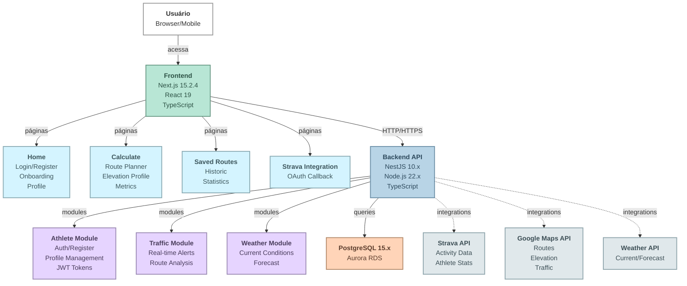

  

 

  

---

## sumário

- [📊 Fluxograma geral](#fluxograma-geral)
- [🛠️ Quick start](#quick-start)
- [📌 Requisitos e regras](#requisitos)
- [🚢 Deploy na aws](#deploy)

---

Aplicação backend desenvolvida em NestJS para estimar tempo de percurso, distância, calorias gastas e ganho/perda de elevação com base na velocidade média real do ciclista.
O sistema integra dados do Strava (velocidade média geral) e do Google Maps (distância e rota), proporcionando cálculos personalizados para ciclistas de diferentes modalidades (MTB, Speed, etc.).

- 🎯 **Status**: Concluído (v1).
- 🎯 **Próximos passos**: Melhorias para v2.

---

## 📊 Fluxograma geral

---

## 🛠️ Como começar (quick start)

este guia reúne o básico para instalar, configurar e rodar o backend localmente:
- [docs/quick-start.md](docs/quick-start.md)

---

## 📌 Requisitos e regras de negócio do velox

#### objetivo da v1:

permitir ao usuário calcular o tempo estimado e o gasto calórico de uma rota ciclística com base em sua velocidade média e dados pessoais, de forma manual ou integrada com o strava.

para rf, rnf e regras de negócio, mais infos na doc:

- [docs/v1/requirements.md](docs/v1/requirements.md)

---

## 🚢 Deploy na aws

- visão geral, diagramas e decisões: [docs/deploy-architecture.md](docs/deploy-architecture.md)
