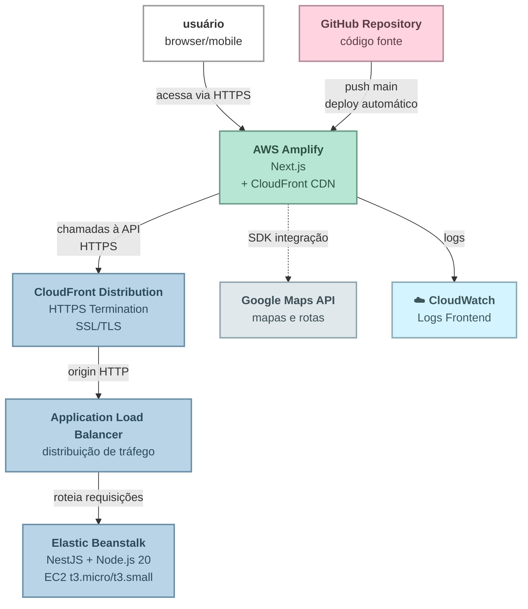
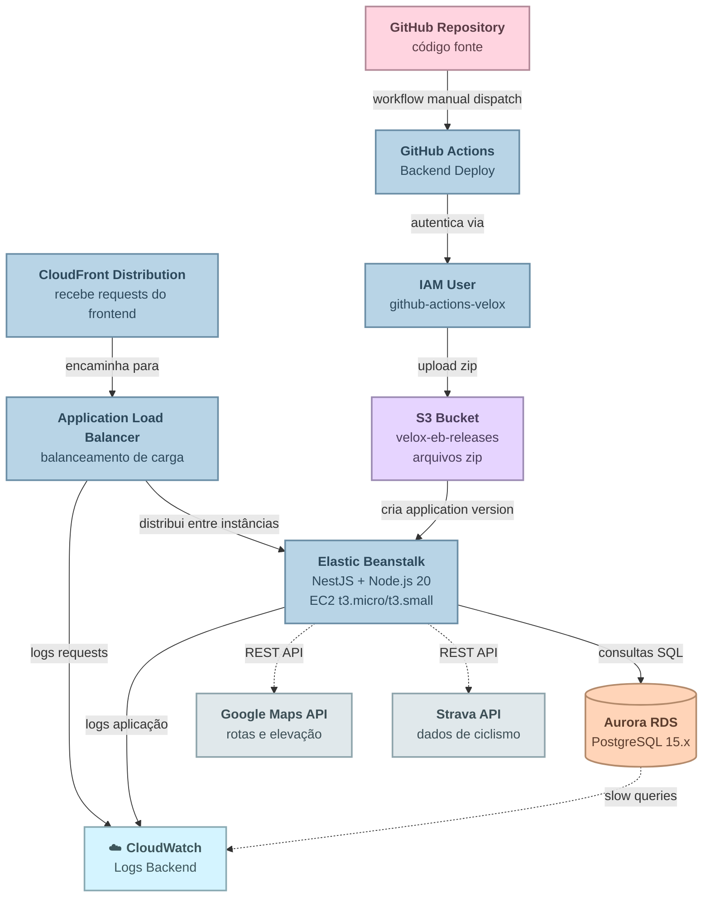

# arquitetura de deploy - projeto velox

- visão geral da arquitetura de deploy do projeto velox na aws usando elastic beanstalk, aurora rds, cloudfront e amplify.
- o projeto foi visado em utilizar somente os recursor disponíveis no free tier da aws;

---

## sumário

1. [📊 visão geral](#visao-geral)
[2. 🔧 componentes](#componentes)
- [🔄 fluxo de deploy](#fluxo-de-deploy)
- [📦 detalhamento dos serviços](#detalhamento-dos-servicos)
- [🔐 segurança](#seguranca)
- [💰 custos mensais (estimados)](#custos-mensais-estimados)
- [📈 escalabilidade](#escalabilidade)
- [🎯 resumo da jornada](#resumo-da-jornada-do-app-runner-ao-elastic-beanstalk)

---

<a id="visao-geral"></a>

## visão geral

### fluxo do usuário (frontend)



---

### ⚙️ fluxo do backend (api + database + ci/cd)



---

### por que cada serviço?

| serviço | motivo | alternativa considerada |
|---------|--------|------------------------|
| **elastic beanstalk** | único serviço de hospedagem de api node.js no free tier da aws | app runner (pago, mais moderno) |
| **s3 (velox-eb-releases)** | elastic beanstalk precisa que o código seja zipado e armazenado no s3 antes de criar uma application version | n/a - requisito do eb |
| **aurora rds** | banco postgresql gerenciado, backups automáticos, escalável | ec2 com postgres (mais trabalho) |
| **cloudfront (api)** | terminar https para a api, já que certificado ssl customizado não está no free tier do eb | certificado ssl pago ou deixar http |
| **amplify** | deploy automático do next.js com cdn global incluso | s3 + cloudfront manual |
| **cloudfront (amplify)** | já incluso no amplify, distribui globalmente o frontend | n/a - vem junto |

### por que usar o cloudfront?

**problema original:**
- frontend no amplify = https (obrigatório)
- backend no elastic beanstalk = http (ssl customizado é pago)
- navegadores bloqueiam requests https → http (mixed content)

**solução implementada:**
1. criar cloudfront distribution na frente do elastic beanstalk
2. cloudfront aceita https do frontend
3. cloudfront faz request http para o elastic beanstalk (origin)
4. usuário vê tudo como https

---

<a id="componentes"></a>

## componentes

### backend (back-velox)

**tecnologia:** nestjs + typescript
**deploy:** elastic beanstalk
**região:** us-east-1 (ou configurada)

**endpoints:**
- production: `https://velox-api-env.elasticbeanstalk.com`
- docs: `https://velox-api-env.elasticbeanstalk.com/docs`
- health: `https://velox-api-env.elasticbeanstalk.com/`

**recursos aws:**
- elastic beanstalk environment
- ec2 instance (gerenciada pelo eb)
- load balancer
- auto scaling group
- cloudwatch logs

### frontend (front-velox)

**tecnologia:** next.js 15 + react 19 + typescript
**deploy:** aws amplify hosting
**região:** global (cloudfront)

**recursos aws:**
- amplify hosting app
- cloudfront distribution
- s3 bucket (artifacts)
- cloudwatch logs
- certificate manager (ssl)

### banco de dados

**tecnologia:** postgresql 15.x
**deploy:** rds
**região:** us-east-1 (mesma do backend)

**configuração:**
- instance: db.t3.micro (free tier) ou db.t4g.small (production)
- storage: 20gb gp3
- backup: 7 dias de retenção
- encryption: habilitado

**acesso:**
- endpoint: `velox-db.xxxxx.us-east-1.rds.amazonaws.com:5432`
- database: `velox`
- user: `postgres`

---
<a id="fluxo-de-deploy"></a>

## fluxo de deploy

### backend (manual via github actions)

1. **developer acessa github actions**
   - vai em actions → "deploy to production"
   - clica em "run workflow" (trigger manual)

2. **github actions workflow executa:**
   - checkout do código
   - setup node 20 + pnpm
   - install dependencies (`pnpm install --frozen-lockfile`)
   - build da aplicação (`pnpm run build`)
   - create zip package com dist + node_modules + package.json

3. **deploy no elastic beanstalk:**
   - usa credenciais do iam user `github-actions-velox`
   - upload do zip para s3 bucket `velox-eb-releases`
   - create application version no elastic beanstalk
   - update environment com nova versão
   - elastic beanstalk faz rolling deployment
   - health check automático (endpoint `/`)
   - rollout completo

4. **elastic beanstalk internamente:**
   - load balancer redireciona tráfego
   - auto scaling group gerencia instâncias
   - ec2 instances rodam a aplicação node.js
   - cloudwatch registra logs e métricas

**tempo:** ~5-10 minutos
**custo:** $0 no free tier (750h/mês de ec2 t3.micro)

### frontend (manual ou automático via github actions)

1. **developer push → main branch ou trigger manual**

2. **deploy no amplify:**
   - amplify faz build e deploy
   - cloudfront invalida cache automaticamente
   - deploy para edge locations globalmente
   - ssl/tls gerenciado automaticamente

**tempo:** ~5-10 minutos
**custo:** $0 no free tier (1000 build min/mês, 15gb data/mês)

### por que deploy manual no backend?

1. **controle total:** deploy apenas quando realmente pronto
2. **economia:** não desperdiça builds em commits de wip
3. **segurança:** evita deploys acidentais de código quebrado
4. **free tier:** economiza minutos de build (limite mensal)

---

<a id="detalhamento-dos-servicos"></a>

## detalhamento dos serviços

### s3 bucket: velox-eb-releases

**o que é:**
bucket s3 usado para armazenar os arquivos zip das versões da aplicação.

**por que precisa:**
o elastic beanstalk não aceita upload direto do código. o fluxo é:
1. código é zipado no github actions
2. zip é enviado para o s3
3. elastic beanstalk cria uma "application version" apontando para o zip no s3
4. elastic beanstalk faz deploy dessa versão nas instâncias ec2


**permissões necessárias (iam):**
```json
{
  "effect": "allow",
  "action": [
    "s3:putobject",
    "s3:getobject",
    "s3:listbucket"
  ],
  "resource": [
    "arn:aws:s3:::velox-eb-releases",
    "arn:aws:s3:::velox-eb-releases/*"
  ]
}
```

---

### cloudfront distribution (api)

**o que é:**
cdn que fica na frente do elastic beanstalk para terminar https.

**por que usar:**
- **ssl grátis:** certificado ssl/tls gerenciado pela aws
- **https obrigatório:** resolve problema de mixed content
- **sem domínio customizado:** não precisa comprar domínio (fora do free tier)
- **global:** baixa latência em múltiplas regiões

---

<a id="seguranca"></a>

## segurança

### iam users

```
github-actions-velox           → backend deploy (eb, s3)

```

### secrets (github)

**backend (repository secrets):**

| secret | descrição | exemplo |
|--------|-----------|---------|
| `AWS_ACCESS_KEY_ID` | access key do iam user `github-actions-velox` | `AKIAIOSFODNN7_EXAMPLE` |
| `AWS_SECRET_ACCESS_KEY` | secret key do iam user | `wJalrXUtnFEMI/K7MDENG/bPxRfiCYlko_EXAMPLEKEY` |
| `AWS_REGION` | região da aws | `us-east-1-example` |
| `EB_APP_NAME` | nome da aplicação no elastic beanstalk | `velox-api-example` |
| `EB_ENV_NAME` | nome do environment no elastic beanstalk | `velox-api-env-example` |
| `EB_S3_BUCKET` | bucket s3 para releases | `velox-eb-releases-example` |


**políticas iam necessárias:**

`github-actions-velox` precisa de:
```json
{
  "version": "2012-10-17",
  "statement": [
    {
      "effect": "allow",
      "action": [
        "elasticbeanstalk:createapplicationversion",
        "elasticbeanstalk:describeapplications",
        "elasticbeanstalk:describeenvironments",
        "elasticbeanstalk:describeeventss",
        "elasticbeanstalk:updateenvironment"
      ],
      "resource": "*"
    },
    {
      "effect": "allow",
      "action": [
        "s3:putobject",
        "s3:getobject",
        "s3:listbucket"
      ],
      "resource": [
        "arn:aws:s3:::velox-eb-releases",
        "arn:aws:s3:::velox-eb-releases/*"
      ]
    },
  ]
}
```

### cors

no backend (`ALLOWED_ORIGINS`):
```
http://localhost:3000,https://production.amplifyapp.com
```
sem espaços e sem barra final. opcionalmente, definir response headers policy no cloudfront para fallback.

### ssl/tls

- **backend:** gerenciado pelo elastic beanstalk
- **frontend:** gerenciado pelo amplify (certificate manager)

---

<a id="custos-mensais-estimados"></a>

## custos mensais (estimados)

### após free tier

| serviço | configuração | custo mensal |
|---------|--------------|--------------|
| elastic beanstalk | t3.small | $15-25 |
| load balancer | application lb | $18 |
| rds | t4g.small | $30 |
| amplify | build + hosting | $2.50-5 |
| cloudwatch | logs | $5-10 |
| route 53 | domínio (opcional) | $1 |
| **total** | | **$70-90/mês** |

### para escala média (10k usuários/mês)

| serviço | configuração | custo mensal |
|---------|--------------|--------------|
| elastic beanstalk | t3.medium × 2 | $60-80 |
| load balancer | application lb | $18 |
| rds | t4g.medium | $60 |
| amplify | build + hosting | $10-20 |
| cloudwatch | logs + metrics | $15-25 |
| route 53 | domínio + traffic | $1-5 |
| **total** | | **$164-208/mês** |

---

<a id="escalabilidade"></a>

## escalabilidade

### backend (elastic beanstalk)

**auto scaling:**
- min instances: 1
- max instances: 4
- trigger: cpu > 70% ou requests > 1000/min

**vertical scaling:**
- t3.micro → t3.small → t3.medium → t3.large

**database:**
- t3.micro → t4g.small → t4g.medium → t4g.large
- read replicas para leitura pesada

### frontend (amplify)

**cdn automático:**
- cloudfront distribui globalmente
- cache nas edge locations
- baixa latência mundial

**build concurrency:**
- múltiplos builds em paralelo
- preview environments para prs

---

<a id="resumo-da-jornada-do-app-runner-ao-elastic-beanstalk"></a>

## resumo da jornada: do app runner ao elastic beanstalk

**objetivo:** deploy da api nestjs na aws mantendo free tier

**primeira escolha:** aws app runner
- serviço moderno e gerenciado
- suporta docker nativamente
- configuração simples
- deploy automático

**problema encontrado:**

```
X app runner não está disponível no free tier
X custo: ~$20-40/mês (inviável para projeto pessoal)
```

---

### a solução implementada

**nova escolha:** elastic beanstalk
- dentro do free tier (750h/mês de ec2 t3.micro)
- suporta node.js nativamente
- gerencia load balancer, auto scaling, ec2
- integração com cloudwatch

**mas trouxe novos desafios:**

#### 1. elastic beanstalk precisa de s3

**problema:** eb não aceita upload direto do código
**solução:** criar bucket s3 `velox-eb-releases`
**como funciona:**
```
código local → zip → upload s3 → eb cria version → deploy
```

#### 2. github actions precisa de permissões

**problema:** ci/cd precisa acessar eb e s3
**solução:** criar iam user `github-actions-velox`
**permissões:** elasticbeanstalk:*, s3:* (no bucket específico)

#### 3. frontend https ↔ backend http = mixed content

**problema:** amplify força https, eb sem domínio = http
**solução:** cloudfront na frente do elastic beanstalk
**como funciona:**
```
frontend (https) → cloudfront (https) → eb (http)
```

---

### checklist de recursos aws criados

#### recursos obrigatórios
- elastic beanstalk application: `velox-api`
- elastic beanstalk environment: `velox-api-env`
- s3 bucket: `velox-eb-releases` (para zips de deploy)
- aurora rds: postgresql 15.x
- cloudfront distribution: https termination para api
- aws amplify: hosting do frontend
- iam user: `github-actions-velox` (deploy backend)

#### recursos automáticos (criados pelo eb)
- ec2 instances (gerenciadas pelo eb)
- application load balancer
- auto scaling group
- security groups
- cloudwatch log groups

---

### custo mensal (estimativa)

**dentro do free tier (primeiro ano):**
```
elastic beanstalk:        $0    (750h/mês ec2 t3.micro)
aurora rds:               $0    (750h/mês db.t3.micro)
amplify:                  $0    (1000 build min, 15gb data)
s3:                       $0    (5gb storage, 20k requests)
cloudfront:               $0    (1tb data transfer)
────────────────────────────
total:                    $0/mês
```

**após free tier:**
```
elastic beanstalk:      $15-25   (t3.small + alb)
aurora rds:             $30      (db.t4g.small)
amplify:                $2-5     (build + hosting)
s3:                     $1       (storage + requests)
cloudfront:             $5-10    (data transfer)
cloudwatch:             $5       (logs)
────────────────────────────
total:                  $58-76/mês
```

---


