# arquitetura de deploy - projeto velox

visão geral da arquitetura de deploy do projeto velox na aws usando elastic beanstalk, aurora rds, cloudfront e amplify.

## 📊 visão geral

### 🎨 fluxo do usuário (frontend)

```mermaid
graph TB
  %% usuário
  U[<b>usuário</b><br/>browser/mobile]

  %% frontend
  U -->|acessa via HTTPS| AMP[<b>AWS Amplify</b><br/>Next.js<br/>+ CloudFront CDN]
  
  %% api calls
  AMP -->|chamadas à API<br/>HTTPS| CF[<b>CloudFront Distribution</b><br/>HTTPS Termination<br/>SSL/TLS]
  
  %% backend
  CF -->|origin HTTP| ALB[<b>Application Load Balancer</b><br/>distribuição de tráfego]
  ALB -->|roteia requisições| EB[<b>Elastic Beanstalk</b><br/>NestJS + Node.js 20<br/>EC2 t3.micro/t3.small]
  
  %% apis externas frontend
  AMP -.->|SDK integração| GMAPS[<b>Google Maps API</b><br/>mapas e rotas]
  
  %% ci/cd frontend automático
  GH[<b>GitHub Repository</b><br/>código fonte]
  GH -->|push main<br/>deploy automático| AMP
  
  %% monitoramento
  AMP -->|logs| CWFRONT[☁️ <b>CloudWatch</b><br/>Logs Frontend]

  %% estilo com tons pastéis suaves
  classDef frontend fill:#B8E6D5,stroke:#6B9B87,stroke-width:2px,color:#2D5245
  classDef backend fill:#B8D4E6,stroke:#6B8EA6,stroke-width:2px,color:#2D495C
  classDef external fill:#E0E8EB,stroke:#8FA5AC,stroke-width:2px,color:#3D4F56
  classDef cicd fill:#FFD4E0,stroke:#B38A99,stroke-width:2px,color:#5C3D47
  classDef monitoring fill:#D4F4FF,stroke:#8AAAB3,stroke-width:2px,color:#3D565C
  classDef user fill:#FFF,stroke:#999,stroke-width:2px,color:#333

  class U user
  class AMP frontend
  class CF,ALB,EB backend
  class GMAPS external
  class GH cicd
  class CWFRONT monitoring
```



---

### ⚙️ fluxo do backend (api + database + ci/cd)

```mermaid

graph TB
  CF[<b>CloudFront Distribution</b><br/>recebe requests do frontend]
  CF -->|encaminha para| ALB[<b>Application Load Balancer</b><br/>balanceamento de carga]
  ALB -->|distribui entre instâncias| EB[<b>Elastic Beanstalk</b><br/>NestJS + Node.js 20<br/>EC2 t3.micro/t3.small]
  EB -->|consultas SQL<br/>| RDS[(<b>Aurora RDS</b><br/>PostgreSQL 15.x<br/>)]
  EB -.->|REST API| STRAVA[<b>Strava API</b><br/>dados de ciclismo]
  EB -.->|REST API| GMAPS[<b>Google Maps API</b><br/>rotas e elevação]
  GH[<b>GitHub Repository</b><br/>código fonte]
  GH -->|workflow manual dispatch| GHBACK[<b>GitHub Actions</b><br/>Backend Deploy]
  GHBACK -->|autentica via| IAMBACK[<b>IAM User</b><br/>github-actions-velox]
  IAMBACK -->|upload zip| S3[<b>S3 Bucket</b><br/>velox-eb-releases<br/>arquivos zip]
  S3 -->|cria application version| EB
  EB -->|logs aplicação| CW[☁️ <b>CloudWatch</b><br/>Logs Backend]
  ALB -->|logs requests| CW
  RDS -.->|slow queries| CW
  classDef backend fill:#B8D4E6,stroke:#6B8EA6,stroke-width:2px,color:#2D495C
  classDef database fill:#FFD4B8,stroke:#B38A6B,stroke-width:2px,color:#5C3D2D
  classDef storage fill:#E6D4FF,stroke:#9B8AB3,stroke-width:2px,color:#4A3D5C
  classDef external fill:#E0E8EB,stroke:#8FA5AC,stroke-width:2px,color:#3D4F56
  classDef cicd fill:#FFD4E0,stroke:#B38A99,stroke-width:2px,color:#5C3D47
  classDef monitoring fill:#D4F4FF,stroke:#8AAAB3,stroke-width:2px,color:#3D565C
  class CF,ALB,EB,GHBACK,IAMBACK backend
  class RDS database
  class S3 storage
  class GMAPS,STRAVA external
  class GH cicd
  class CW monitoring
```



### por que cada serviço?

| serviço | motivo | alternativa considerada |
|---------|--------|------------------------|
| **elastic beanstalk** | único serviço de hospedagem de api node.js no free tier da aws | app runner (pago, mais moderno) |
| **s3 (velox-eb-releases)** | elastic beanstalk precisa que o código seja zipado e armazenado no s3 antes de criar uma application version | n/a - requisito do eb |
| **aurora rds** | banco postgresql gerenciado, backups automáticos, escalável | ec2 com postgres (mais trabalho) |
| **cloudfront (api)** | terminar https para a api, já que certificado ssl customizado não está no free tier do eb | certificado ssl pago ou deixar http |
| **amplify** | deploy automático do next.js com cdn global incluso | s3 + cloudfront manual |
| **cloudfront (amplify)** | já incluso no amplify, distribui globalmente o frontend | n/a - vem junto |

### por que usar o cloudfront?

**problema original:**
- frontend no amplify = https (obrigatório)
- backend no elastic beanstalk = http (ssl customizado é pago)
- navegadores bloqueiam requests https → http (mixed content)

**solução implementada:**
1. criar cloudfront distribution na frente do elastic beanstalk
2. cloudfront aceita https do frontend
3. cloudfront faz request http para o elastic beanstalk (origin)
4. usuário vê tudo como https

---

## 🔧 componentes

### backend (back-velox)

**tecnologia:** nestjs + typescript
**deploy:** elastic beanstalk
**região:** us-east-1 (ou configurada)

**endpoints:**
- production: `https://velox-api-env.elasticbeanstalk.com`
- docs: `https://velox-api-env.elasticbeanstalk.com/docs`
- health: `https://velox-api-env.elasticbeanstalk.com/`

**recursos aws:**
- elastic beanstalk environment
- ec2 instance (gerenciada pelo eb)
- load balancer
- auto scaling group
- cloudwatch logs

### frontend (front-velox)

**tecnologia:** next.js 15 + react 19 + typescript
**deploy:** aws amplify hosting
**região:** global (cloudfront)

**recursos aws:**
- amplify hosting app
- cloudfront distribution
- s3 bucket (artifacts)
- cloudwatch logs
- certificate manager (ssl)

### banco de dados

**tecnologia:** postgresql 15.x
**deploy:** rds
**região:** us-east-1 (mesma do backend)

**configuração:**
- instance: db.t3.micro (free tier) ou db.t4g.small (production)
- storage: 20gb gp3
- backup: 7 dias de retenção
- encryption: habilitado

**acesso:**
- endpoint: `velox-db.xxxxx.us-east-1.rds.amazonaws.com:5432`
- database: `velox`
- user: `postgres`

---

## 🔄 fluxo de deploy

### backend (manual via github actions)

1. **developer acessa github actions**
   - vai em actions → "deploy to production"
   - clica em "run workflow" (trigger manual)

2. **github actions workflow executa:**
   - checkout do código
   - setup node 20 + pnpm
   - install dependencies (`pnpm install --frozen-lockfile`)
   - build da aplicação (`pnpm run build`)
   - create zip package com dist + node_modules + package.json

3. **deploy no elastic beanstalk:**
   - usa credenciais do iam user `github-actions-velox`
   - upload do zip para s3 bucket `velox-eb-releases`
   - create application version no elastic beanstalk
   - update environment com nova versão
   - elastic beanstalk faz rolling deployment
   - health check automático (endpoint `/`)
   - rollout completo

4. **elastic beanstalk internamente:**
   - load balancer redireciona tráfego
   - auto scaling group gerencia instâncias
   - ec2 instances rodam a aplicação node.js
   - cloudwatch registra logs e métricas

**tempo:** ~5-10 minutos
**custo:** $0 no free tier (750h/mês de ec2 t3.micro)

### frontend (manual ou automático via github actions)

1. **developer push → main branch ou trigger manual**

2. **deploy no amplify:**
   - amplify faz build e deploy
   - cloudfront invalida cache automaticamente
   - deploy para edge locations globalmente
   - ssl/tls gerenciado automaticamente

**tempo:** ~5-10 minutos
**custo:** $0 no free tier (1000 build min/mês, 15gb data/mês)

### por que deploy manual no backend?

1. **controle total:** deploy apenas quando realmente pronto
2. **economia:** não desperdiça builds em commits de wip
3. **segurança:** evita deploys acidentais de código quebrado
4. **free tier:** economiza minutos de build (limite mensal)

---

## 📦 detalhamento dos serviços

### s3 bucket: velox-eb-releases

**o que é:**
bucket s3 usado para armazenar os arquivos zip das versões da aplicação.

**por que precisa:**
o elastic beanstalk não aceita upload direto do código. o fluxo é:
1. código é zipado no github actions
2. zip é enviado para o s3
3. elastic beanstalk cria uma "application version" apontando para o zip no s3
4. elastic beanstalk faz deploy dessa versão nas instâncias ec2


**permissões necessárias (iam):**
```json
{
  "effect": "allow",
  "action": [
    "s3:putobject",
    "s3:getobject",
    "s3:listbucket"
  ],
  "resource": [
    "arn:aws:s3:::velox-eb-releases",
    "arn:aws:s3:::velox-eb-releases/*"
  ]
}
```

---

### cloudfront distribution (api)

**o que é:**
cdn que fica na frente do elastic beanstalk para terminar https.

**por que usar:**
- **ssl grátis:** certificado ssl/tls gerenciado pela aws
- **https obrigatório:** resolve problema de mixed content
- **sem domínio customizado:** não precisa comprar domínio (fora do free tier)
- **global:** baixa latência em múltiplas regiões

---

## 🔐 segurança

### iam users

```
github-actions-velox           → backend deploy (eb, s3)

```

### secrets (github)

**backend (repository secrets):**

| secret | descrição | exemplo |
|--------|-----------|---------|
| `AWS_ACCESS_KEY_ID` | access key do iam user `github-actions-velox` | `AKIAIOSFODNN7_EXAMPLE` |
| `AWS_SECRET_ACCESS_KEY` | secret key do iam user | `wJalrXUtnFEMI/K7MDENG/bPxRfiCYlko_EXAMPLEKEY` |
| `AWS_REGION` | região da aws | `us-east-1-example` |
| `EB_APP_NAME` | nome da aplicação no elastic beanstalk | `velox-api-example` |
| `EB_ENV_NAME` | nome do environment no elastic beanstalk | `velox-api-env-example` |
| `EB_S3_BUCKET` | bucket s3 para releases | `velox-eb-releases-example` |


**políticas iam necessárias:**

`github-actions-velox` precisa de:
```json
{
  "version": "2012-10-17",
  "statement": [
    {
      "effect": "allow",
      "action": [
        "elasticbeanstalk:createapplicationversion",
        "elasticbeanstalk:describeapplications",
        "elasticbeanstalk:describeenvironments",
        "elasticbeanstalk:describeeventss",
        "elasticbeanstalk:updateenvironment"
      ],
      "resource": "*"
    },
    {
      "effect": "allow",
      "action": [
        "s3:putobject",
        "s3:getobject",
        "s3:listbucket"
      ],
      "resource": [
        "arn:aws:s3:::velox-eb-releases",
        "arn:aws:s3:::velox-eb-releases/*"
      ]
    },
  ]
}
```

### cors

no backend (`ALLOWED_ORIGINS`):
```
http://localhost:3000,https://production.d123abc456def7.amplifyapp.com
```
sem espaços e sem barra final. opcionalmente, definir response headers policy no cloudfront para fallback.

### ssl/tls

- **backend:** gerenciado pelo elastic beanstalk
- **frontend:** gerenciado pelo amplify (certificate manager)

---

## 💰 custos mensais (estimados)

### após free tier

| serviço | configuração | custo mensal |
|---------|--------------|--------------|
| elastic beanstalk | t3.small | $15-25 |
| load balancer | application lb | $18 |
| rds | t4g.small | $30 |
| amplify | build + hosting | $2.50-5 |
| cloudwatch | logs | $5-10 |
| route 53 | domínio (opcional) | $1 |
| **total** | | **$70-90/mês** |

### para escala média (10k usuários/mês)

| serviço | configuração | custo mensal |
|---------|--------------|--------------|
| elastic beanstalk | t3.medium × 2 | $60-80 |
| load balancer | application lb | $18 |
| rds | t4g.medium | $60 |
| amplify | build + hosting | $10-20 |
| cloudwatch | logs + metrics | $15-25 |
| route 53 | domínio + traffic | $1-5 |
| **total** | | **$164-208/mês** |

---

## 📈 escalabilidade

### backend (elastic beanstalk)

**auto scaling:**
- min instances: 1
- max instances: 4
- trigger: cpu > 70% ou requests > 1000/min

**vertical scaling:**
- t3.micro → t3.small → t3.medium → t3.large

**database:**
- t3.micro → t4g.small → t4g.medium → t4g.large
- read replicas para leitura pesada

### frontend (amplify)

**cdn automático:**
- cloudfront distribui globalmente
- cache nas edge locations
- baixa latência mundial

**build concurrency:**
- múltiplos builds em paralelo
- preview environments para prs

---

## 🚀 boas práticas

### desenvolvimento

- sempre testar build local antes de deploy
- usar feature branches para desenvolvimento
- testes automatizados no ci/cd

### deploy

- manter backup antes de grandes mudanças
- monitorar métricas após deploy
- ter plano de rollback pronto

### segurança

- rotacionar access keys a cada 90 dias
- usar least privilege para iam
- manter dependências atualizadas
- habilitar mfa para console aws

### custos

- revisar billing alerts mensalmente
- desativar recursos não utilizados
- usar reserved instances para produção
- otimizar queries de banco
- configurar lifecycle policies para logs

---

## 📚 documentação

### backend
- `/back-velox/docs/aws-setup.md` - guia completo
- `/back-velox/docs/quick-start.md` - início rápido
- `/back-velox/docs/deploy-checklist.md` - checklist

### frontend
- `/front-velox/docs/aws-amplify-setup.md` - guia completo
- `/front-velox/docs/quick-start.md` - início rápido
- `/front-velox/docs/deploy-checklist.md` - checklist
- `/front-velox/docs/faq-deploy.md` - faq

### geral
- `/back-velox/README.md` - readme backend
- `/front-velox/README.md` - readme frontend (está em outro repo)

---

## 🔗 recursos úteis

- [Aws console](https://console.aws.amazon.com)
- [Aws pricing calculator](https://calculator.aws.amazon.com/)
- [Aws status](https://status.aws.amazon.com/)
- [Elastic beanstalk docs](https://docs.aws.amazon.com/elasticbeanstalk/)
- [Amplify docs](https://docs.aws.amazon.com/amplify/)
- [Rds docs](https://docs.aws.amazon.com/rds/)

---

## resumo da jornada: do app runner ao elastic beanstalk

**objetivo:** deploy da api nestjs na aws mantendo free tier

**primeira escolha:** aws app runner
- serviço moderno e gerenciado
- suporta docker nativamente
- configuração simples
- deploy automático

**problema encontrado:**

```
❌ app runner não está disponível no free tier
❌ custo: ~$20-40/mês (inviável para projeto pessoal)
```

---

### a solução implementada

**nova escolha:** elastic beanstalk
- dentro do free tier (750h/mês de ec2 t3.micro)
- suporta node.js nativamente
- gerencia load balancer, auto scaling, ec2
- integração com cloudwatch

**mas trouxe novos desafios:**

#### 1. elastic beanstalk precisa de s3

**problema:** eb não aceita upload direto do código
**solução:** criar bucket s3 `velox-eb-releases`
**como funciona:**
```
código local → zip → upload s3 → eb cria version → deploy
```

#### 2. github actions precisa de permissões

**problema:** ci/cd precisa acessar eb e s3
**solução:** criar iam user `github-actions-velox`
**permissões:** elasticbeanstalk:*, s3:* (no bucket específico)

#### 3. frontend https ↔ backend http = mixed content

**problema:** amplify força https, eb sem domínio = http
**solução:** cloudfront na frente do elastic beanstalk
**como funciona:**
```
frontend (https) → cloudfront (https) → eb (http) ✅
```

---

### checklist de recursos aws criados

#### recursos obrigatórios
- elastic beanstalk application: `velox-api`
- elastic beanstalk environment: `velox-api-env`
- s3 bucket: `velox-eb-releases` (para zips de deploy)
- aurora rds: postgresql 15.x
- cloudfront distribution: https termination para api
- aws amplify: hosting do frontend
- iam user: `github-actions-velox` (deploy backend)

#### recursos automáticos (criados pelo eb)
- ec2 instances (gerenciadas pelo eb)
- application load balancer
- auto scaling group
- security groups
- cloudwatch log groups

---

### custo mensal (estimativa)

**dentro do free tier (primeiro ano):**
```
elastic beanstalk:        $0    (750h/mês ec2 t3.micro)
aurora rds:               $0    (750h/mês db.t3.micro)
amplify:                  $0    (1000 build min, 15gb data)
s3:                       $0    (5gb storage, 20k requests)
cloudfront:               $0    (1tb data transfer)
────────────────────────────
total:                    $0/mês
```

**após free tier:**
```
elastic beanstalk:      $15-25   (t3.small + alb)
aurora rds:             $30      (db.t4g.small)
amplify:                $2-5     (build + hosting)
s3:                     $1       (storage + requests)
cloudfront:             $5-10    (data transfer)
cloudwatch:             $5       (logs)
────────────────────────────
total:                  $58-76/mês
```

---

### lições aprendidas

1. **app runner vs elastic beanstalk:**
   - app runner: mais moderno, mas pago
   - elastic beanstalk: mais complexo, mas free tier

2. **s3 é obrigatório para eb:**
   - não há como fazer deploy direto
   - s3 é usado como intermediário

4. **cloudfront resolve mixed content:**
   - frontend https + backend http = erro
   - cloudfront termina https gratuitamente

5. **iam permissions são críticas:**
   - github actions precisa de permissões específicas
   - usar least privilege sempre

6. **free tier tem limites:**
   - 750h/mês = 1 instância rodando o mês todo
   - múltiplas instâncias = estoura free tier

---


